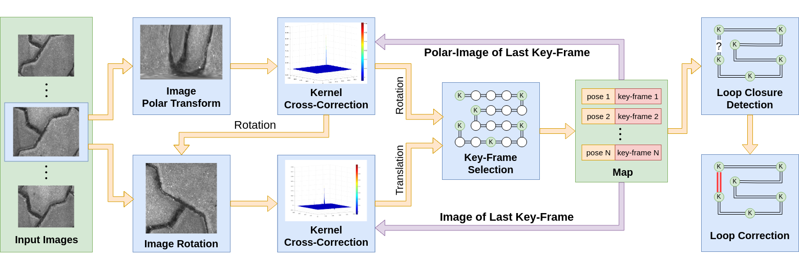
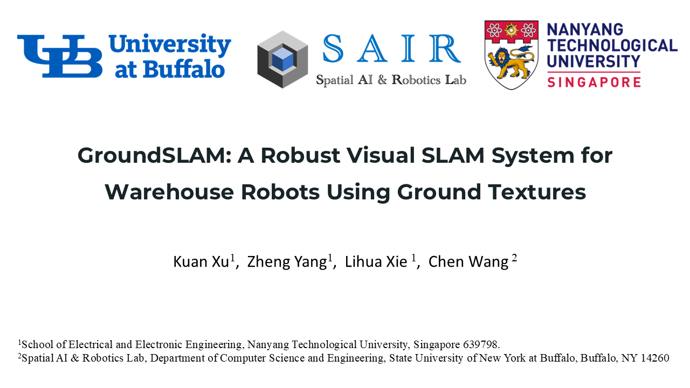
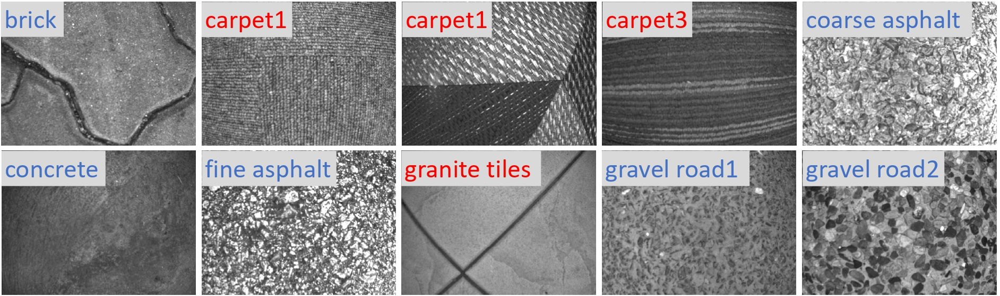
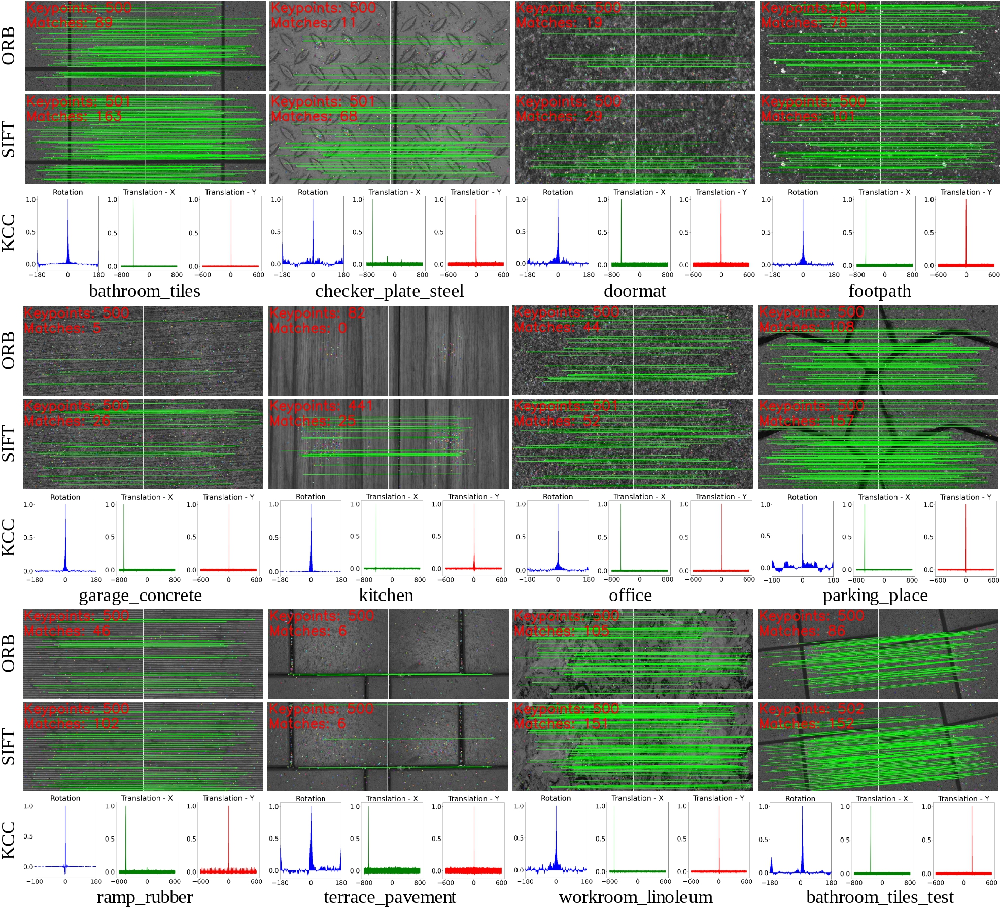
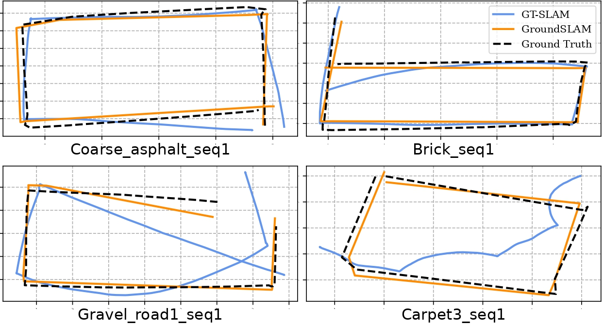
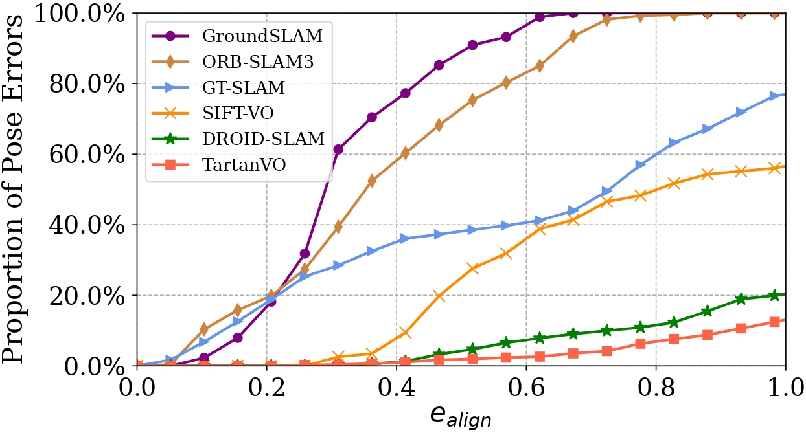
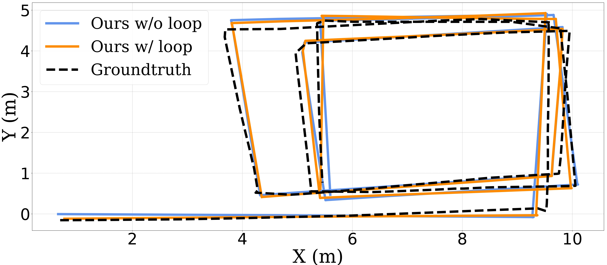
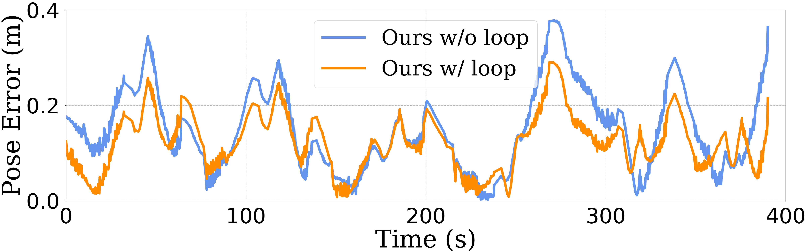

<h1 align="center">GroundSLAM: A Robust Visual SLAM System for Warehouse Robots Using Ground Textures</h1><p align="center"><strong>
    <a href = "https://scholar.google.com/citations?user=-p7HvCMAAAAJ&hl=zh-CN">Kuan Xu</a><sup>1</sup>,
    <a href = "https://github.com/yangzheng-yz">Zheng Yang</a><sup>1</sup>,
    <a href = "https://scholar.google.com.sg/citations?user=Fmrv3J8AAAAJ&hl=en">Lihua Xie</a><sup>1</sup>,
    <a href = "https://sairlab.org/team/chenw/">Chen Wang</a><sup>2</sup>
</strong></p>

<p align="center"><strong>
    <a href = "https://www.ntu.edu.sg/cartin">1: Centre for Advanced Robotics Technology Innovation (CARTIN), Nanyang Technological University</a><br>
    <a href = "https://sairlab.org/">2: Spatial AI & Robotics (SAIR) Lab, Computer Science and Engineering, University at Buffalo</a><br>
</strong></p>

<p align="center"><strong> 
    <a href = "https://arxiv.org/pdf/1710.05502">&#128196; [PDF]</a> | 
    <!-- <a href = "https://xukuanhit.github.io/airslam/">&#128190; [Project Site]</a> | -->
    <a href = "https://youtu.be/2sI76SDptDA">&#127909; [Youtube]</a> |
    <!-- <a href = "https://www.bilibili.com/video/BV1rJY7efE9x">&#127909; [Bilibili]</a> -->
    <!-- &#128214; [OpenAccess] -->
</strong></p>




GroundSLAM is a novel **feature-free** and **ground-texture-based** SLAM system for **the warehouse robot**. Our system can provide robust pose estimation and localization in environments with many **dynamic** objects or **open spaces**, such as warehouses, which is very challenging for localization systems with a forward-facing camera or LiDAR. GroundSLAM consists of three components: feature-free visual odometry, ground-texture-based loop detection and map optimization, and map reuse. Specifically, we introduce a kernel cross-correlator (KCC) for **image-level pose tracking**, loop detection, and map reuse to improve localization accuracy and robustness, and incorporate adaptive pruning strategies to enhance efficiency. Due to these specific designs, GroundSLAM more **robust** and **accurate** when dealing with ground images with **few textures** or with many **repetitive patterns** than the feature-based methods.


**Video:**


<p align="middle">
<a href="https://youtu.be/2sI76SDptDA" target="_blank"></a>
</p>

## Test Environment
### Dependencies
* OpenCV 4.2
* Eigen 3
* Ceres 2.0.0 
* FFTW3
* ROS noetic
* Boost
* yaml-cpp
* VTK

## Build
```
    cd ~/catkin_ws/src
    git clone https://github.com/sair-lab/GroundSLAM.git
    cd ../
    catkin_make
    source ~/catkin_ws/devel/setup.bash
```

## Run 

Modify the configuration file in [configs](configs) and then run

```
rosrun ground_slam ground_slam src/kcc_slam/configs/your_config.yaml
```

## Data

### PathTex Dataset

 


Our data collection platform is a modified Weston SCOUT Robot. The robot is equipped with an IDS uEye monocular camera, which is positioned at the bottom and facing downward, placed at a height of 0.1m above the ground. To ensure constant illumination, a set of LED lights are arranged around the camera. For ground truth, a prism is installed on the top of the robot, and its position is tracked by a Leica Nova MS60 MultiStation laser tracker.

We collect the data of 10 common ground textures, including 6 $\color{lightblue}{outdoor}$ textures and 4 $\color{red}{indoor}$ textures. The table below provides detailed information and download links for each sequence. The camera parameters can be found [here](https://entuedu-my.sharepoint.com/:u:/g/personal/kuan_xu_staff_main_ntu_edu_sg/EQqXW2eDcXNAkBWlSGgq6bgBe2yYdjdcuSJ8HEFey3haGg?e=nOg2ym).

  <!-- <div align=center> -->
  
  
Sequence Name|Total Size|Total Images|Download Link
:--:|:--:|:--:|:--:
Brick_seq1|1.0g|3119|[Link](https://entuedu-my.sharepoint.com/:u:/g/personal/kuan_xu_staff_main_ntu_edu_sg/EUMENxrPbQBFmzAQmfhMw4YB4df6_uq6ua7H1fo9A7NC7g?e=5Mzy9Q)
Brick_seq2|0.9g|5328|[Link](https://entuedu-my.sharepoint.com/:u:/g/personal/kuan_xu_staff_main_ntu_edu_sg/EY1-hFr2taZJqjxE4k6-W6oB-XenzRAk_RW8DME6VvqUmg?e=PSQEi6)
Carpet1_seq1|1.7g|8458|[Link](https://entuedu-my.sharepoint.com/:u:/g/personal/kuan_xu_staff_main_ntu_edu_sg/ETuQX1ePORdKmQJ_wFXT1mUBS6MqJ3LoZ-eeUsDhhXouug?e=AmMgBX)
Carpet1_seq2|1.7g|8499|[Link](https://entuedu-my.sharepoint.com/:u:/g/personal/kuan_xu_staff_main_ntu_edu_sg/EQwzCVxFMT1Hh9BMMNljwSgBM27RXd7v8gdM3KMNWm5mDQ?e=aSoH1v)
Carpet2_seq1|3.0g|15481|[Link](https://entuedu-my.sharepoint.com/:u:/g/personal/kuan_xu_staff_main_ntu_edu_sg/EZ6Y6xsmk6xBjkkU7JNrVQIB_zTovWY8-AOPdW7AN7XJLw?e=GvlK03)
Carpet3_seq1|0.7g|4500|[Link](https://entuedu-my.sharepoint.com/:u:/g/personal/kuan_xu_staff_main_ntu_edu_sg/EXxxHyPOvsFBh8judFQqhtEB-kI6uBzFmKcCiNDZZBzBIw?e=917b5c)
Carpet3_seq2|0.7g|4385|[Link](https://entuedu-my.sharepoint.com/:u:/g/personal/kuan_xu_staff_main_ntu_edu_sg/EQHoNL0xtpdKj6e6mhBBLyEBl-7s5N0cJ6U47jzT1tJheg?e=ot4hSH)
Carpet3_seq3|1.0g|6428|[Link](https://entuedu-my.sharepoint.com/:u:/g/personal/kuan_xu_staff_main_ntu_edu_sg/EcE3o-HN0UJEpc57_EJM3kcBSVSIQ8M7oCjkWsZlUQRKLw?e=qG8MUM)
Coarse_asphalt_seq1|1.2g|5897|[Link](https://entuedu-my.sharepoint.com/:u:/g/personal/kuan_xu_staff_main_ntu_edu_sg/EQbDBVemPH9Cp7bqV2ZwfFIBD_gsHQ-d3atPfSY8__6DKQ?e=ASludI)
Concrete_seq1|1.0g|5850|[Link](https://entuedu-my.sharepoint.com/:u:/g/personal/kuan_xu_staff_main_ntu_edu_sg/EcIYh8RIhClKs7ogwgFmS_QBlflxcx-eR33BwRVerNXFgg?e=8McLDA)
Concrete_seq2|0.9g|5975|[Link](https://entuedu-my.sharepoint.com/:u:/g/personal/kuan_xu_staff_main_ntu_edu_sg/EbNJ5FdpQSJMqK-2zyoEPNoBNCO4ZzhuzjzTL2m1AYZQKQ?e=feQNUX)
Fine_asphalt_seq1|1.1g|5119|[Link](https://entuedu-my.sharepoint.com/:u:/g/personal/kuan_xu_staff_main_ntu_edu_sg/EY22RWOcM89ApAYEr0E5I5EB6QhINnL5iGsbgli8INjuXg?e=HArfqb)
Fine_asphalt_seq2|1.3g|11897|[Link](https://entuedu-my.sharepoint.com/:u:/g/personal/kuan_xu_staff_main_ntu_edu_sg/ERBTClOvkpBHgNeAEc5co4sBI5E-ubQ2MqNFwlfys07mbQ?e=WDd0uP)
Granite_tiles_seq1|1.2g|7194|[Link](https://entuedu-my.sharepoint.com/:u:/g/personal/kuan_xu_staff_main_ntu_edu_sg/ERNkKMy_nvFFmORT7LU_MxEB7TDzhAsNKEEfBf_cNG4Zbg?e=sjDkYW)
Granite_tiles_seq2|1.6g|10633|[Link](https://entuedu-my.sharepoint.com/:u:/g/personal/kuan_xu_staff_main_ntu_edu_sg/EU-8ocb82WZDpErJuOGfR6oBbQwXEpAzR-nykA6wXk9zeg?e=Vx4P1t)
Gravel_road1_seq1|0.8g|4883|[Link](https://entuedu-my.sharepoint.com/:u:/g/personal/kuan_xu_staff_main_ntu_edu_sg/ERRQQR0VTCVEqSdo9pM85zwBNMQFRBcgev4VVIZtjg68Vg?e=KFxJST)
Gravel_road2_seq1|2.1g|11776|[Link](https://entuedu-my.sharepoint.com/:u:/g/personal/kuan_xu_staff_main_ntu_edu_sg/EZS9BNL-ct1Nu3_Ag1Z0YuIBt6ah02i8vojro4eHexs4ww?e=hQOLIF)
  <!-- </div> -->

### Run with Your Data

The data should be organized in the following format:
```
dataroot
├── image_names.txt
├── rgb
│   ├── 00001.png
│   ├── 00002.png
│   ├── 00003.png
│   └── ......
└── times.txt
```
where `image_names.txt` contains the image names in `/dataroot/rgb` and `times.txt` contains the corresponding double type timestamps. 

## Experiments

### Data Association

 

We compare the data association of our system with ORB and SIFT on the HD Ground dataset. The numbers of features and matching inliers are given. For the KCC, the correction results are projected to three coordinate axes and represent the estimation of the 3-DOF movement. The vertical axis is the confidence of estimated movement on the horizontal axis. The higher the value of the peak relative to other positions, the greater the confidence of motion estimation. The results show that the data association of KCC is more stable for various ground texture images.

### Visual Odometry
<div style="display:flex; justify-content:flex-start;">
    
    
</div>

This experiment is conducted on our PathTex dataset. The left figure shows the trajectories produced by our system and GT-SLAM on 4 sequences. The right figure provides the comparison of error distributions of different systems on the Gravel_road2_seq1 sequence, where the vertical axis is the proportion of pose errors that are less than the given error threshold on the horizontal axis.

### Loop Closure

<div style="display:flex; justify-content:flex-start;">
    
    
</div>

These two figures show the performance difference of GroundSLAM with and without loop correction on the Fine_asphalt_seq2 sequence. It is seen that the pose errors are significantly decreased after the loop correction.
